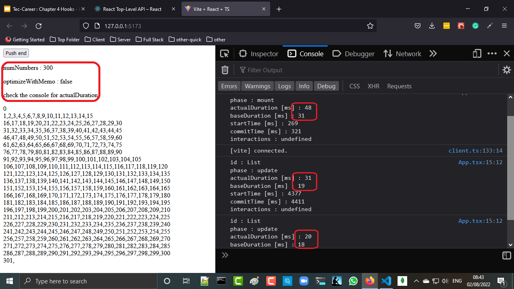
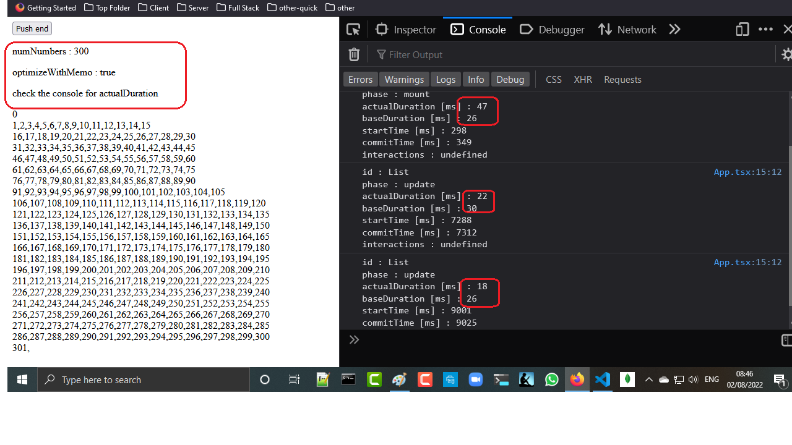

<h2>Motivation</h2>
Play with react profiler api and check the impact of memo on the performance - rendering time of the List (actualDuration)

<h2>Application</h2>
render a list and button to add item on the end

<h2>profiler callback params. i am using also <a href='https://blog.openreplay.com/the-definitive-guide-to-profiling-react-applications'>this reference</a></h2>
<table>
  <tr>
    <th>Name</th>
    <th>Type</th>
    <th>Description</th>
  </tr>
  <tr>
    <td>id</td>
    <td>string</td>
    <td>the "id" prop of the Profiler tree that has just committed.This is useful for differentiating between different components if you’re profiling more than one at the same time or just for identification purposes.</td>
  </tr>
  <tr>
    <td>phase</td>
    <td>"mount" | "update"</td>
    <td>either "mount" (if the tree just mounted) or "update" (if it re-rendered)</td>
  </tr>
  <tr>
    <td>actualDuration</td>
    <td>number</td>
    <td> The time spent in milliseconds rendering the Profiler component (The Profiler adds a tiny performance overhead) and all its descendants</td>
  </tr>
  <tr>
    <td>baseDuration</td>
    <td>number</td>
    <td>The estimated time in milliseconds that would be spent rendering the descendants without any memoisations. The delta between this and actualDuration should tell you how useful your React.memo and useMemo callls are (for more information about these calls, you can read <a href='https://blog.openreplay.com/improving-react-application-performance-react-memo-vs-usememo'>this article on memoisation in React. my remark : seems not relevant when memoization is used</a></td>
  </tr>
  <tr>
    <td>startTime</td>
    <td>number</td>
    <td>A timestamp of when React began rendering the current update</td>
  </tr>
  <tr>
    <td>commitTime</td>
    <td>number</td>
    <td>A timestamp of when React committed the current update</td>
  </tr>
<tr>
    <td>interactions</td>
    <td>Set&lt;SchedulerInteraction&gt;</td>
    <td> A Set of interactions (if any) that were being traced when the update was scheduled</td>
  </tr>
</table>

<h2>rendering without memo</h2>

looking at react dev tools -> Preformance -> Settings -> Highlight updates when component render. You will see that List is rendered and also ListItem

<h2>rendering with memo</h2>

results are better compared to without

looking at react dev tools -> Preformance -> Settings -> Highlight updates when component render. You will see that List is rendered but not ListItemWithMemo because of the memo

<h2>General points of interests</h2>
<ul>
<li>actualDuration and baseDuration are the most important values</li>
<li>it is insteresting that react is doing better job as more 'Push end' . maybe not rendering existing node and just add the new one ,thus react is using key nicely</li>
<li>I am using memo and not useMemo because it was not possible otherwise</li>
</ul>

<h2>Open issues</h2>
<ul>
<li>Given react dev tools : why do i need react profiler api</li>
</ul>
